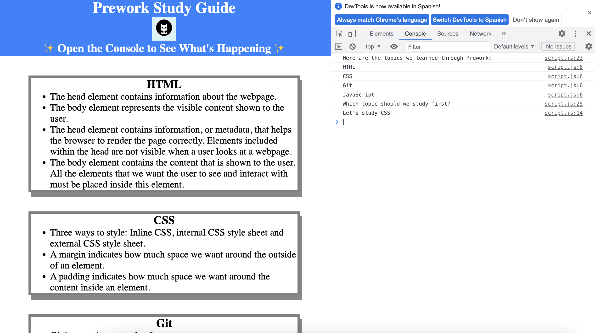

# <Prework Study Guide for Coding Bootcamp>

## Description

This prework study guide was created following a series of lessons in order to be prepared to start a coding bootcamp. I was motivated to do it because was my first coding project and I'm very excited of this new adventure. This project is a helpful tool to keep my notes of the prework modules in one place. 

## Installation

N/A

## Usage

This page is intented to keep the notes of the prework lessons of the coding bootcamp and be a tool to study. Follow this instructions to use it: 
1. Open the application on the browser. 
2. In order to choose a topic to study open the GoogleDev Inspection Tool.
3. Enter console and refresh the page. The console will indicate randomly the suggested topic to study. 

## Credits

N/A

## License
Please refer to the license in the repo.

